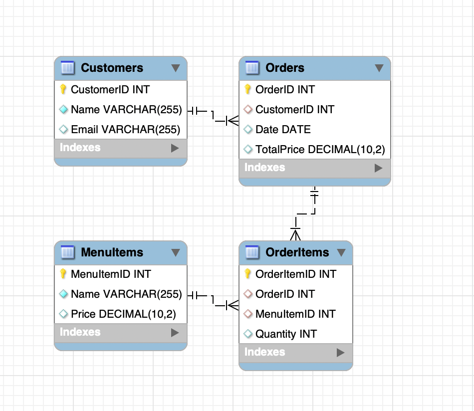

# NaturalSQL




This database schema is designed to manage a customer ordering system for a food or service-related business


## Successful Query

**Question**: What is the average total price of orders placed in the last 2 months?

**GPT SQL Response**:
```sql
SELECT AVG(TotalPrice) AS AverageTotalPrice
FROM Orders
WHERE Date >= date('now', '-2 months');
```

**Friendly Response**: The value is 22.33.


## Unsuccessful Query
It did the SQL part almost right, but didn't quite get the data back in a friendly way. I wanted to know that we wouldn't be able to text/SMS "Bob Jones" who is person id 2 in my database. It returned an id and then couldn't tell me what I wanted to know.


Question: Can you provide the order details for a specific customer by their CustomerID?

**GPT SQL Response**:
```sql
SELECT 
    Orders.OrderID,
    Orders.Date,
    Orders.TotalPrice,
    MenuItems.MenuItemID,
    MenuItems.Price,
    OrderItems.Quantity
FROM 
    Customers
JOIN 
    Orders ON Customers.CustomerID = Orders.CustomerID
JOIN 
    OrderItems ON Orders.OrderID = OrderItems.OrderID
JOIN 
    MenuItems ON OrderItems.MenuItemID = MenuItems.MenuItemID
WHERE 
    Customers.CustomerID = ?;
```

The query was logically valid but lacked the necessary binding for the CustomerID


## Prompting Stratagy
In my implementation, I utilized a one-shot prompting strategy. Initially, when I requested the SQL queries, I encountered errors due to inconsistent casing in the column names generated by ChatGPT. To resolve this, I provided an example of the column names with consistent casing. This adjustment significantly improved the accuracy of the generated SQL queries and eliminated the errors.


## Conclusion
This project was a fun way to use OpenAI’s API to turn user questions into SQL queries. I learned that using a one-shot prompting strategy—where I give clear examples—really helps avoid errors with column casing. Overall, it works great for running queries on an SQLite database and gives back results in a way that’s easy to understand!


